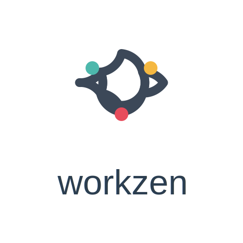

# WorkZen - Modern HRMS Platform

<div align="center">
  
  
  **A comprehensive Human Resource Management System built with modern web technologies**
  
  [](https://reactjs.org/)
  [](https://www.typescriptlang.org/)
  [](https://nodejs.org/)
  [](https://www.mysql.com/)
</div>

---

## 📋 Table of Contents
- [Overview](#overview)
- [Features](#features)
- [Technology Stack](#technology-stack)
- [Installation](#installation)
- [Project Structure](#project-structure)
- [Key Modules](#key-modules)
- [API Documentation](#api-documentation)
- [Design Philosophy](#design-philosophy)

---

## 🎯 Overview

WorkZen is a full-stack Human Resource Management System designed to streamline HR operations for modern organizations. It provides comprehensive tools for employee management, attendance tracking, leave management, payroll processing, and more.

### Key Highlights
✅ **Attendance-based Payroll** - Automatic salary calculation based on actual attendance  
✅ **Role-based Access Control** - Admin, HR, Payroll Officer, and Employee roles  
✅ **Real-time Attendance Tracking** - Check-in/Check-out with monthly statistics  
✅ **Leave Management** - Request, approve, and track employee leaves  
✅ **Payroll Automation** - Generate payslips with component breakdown  
✅ **Activity Logging** - Track all system activities for audit trails  
✅ **User Management** - Complete employee lifecycle management  
✅ **Profile Customization** - Upload profile pictures and manage personal info

---

## 🚀 Features

### 👥 Employee Management
- Complete employee lifecycle management (onboarding to exit)
- Employee profiles with personal details, documents, and salary info
- Department and position management
- Profile picture upload with validation
- Unique login IDs for secure access

### ⏰ Attendance Management
- **Real-time Check-in/Check-out** - Track employee attendance with timestamps
- **Monthly Statistics Dashboard** - View days present, leaves taken, and total working days
- **Day-wise Attendance Records** - Detailed attendance history with filters
- **Break Time Tracking** - Monitor working hours including breaks
- **Role-based Visibility** - Employees see only employee attendance, admins see all
- **Working Source Integration** - Attendance data drives payroll calculations

### 🏖️ Leave Management
- Multiple leave types (Paid, Sick, Casual, Annual, Unpaid)
- Leave request workflow with approval process
- Leave balance tracking
- Calendar view of team absences
- Email notifications for leave actions

### 💰 Payroll Processing
- **Attendance-based Salary Calculation** - Wages calculated based on actual attendance
- **Automatic Payslip Generation** - Monthly payroll processing with component breakdown
- **Salary Components** - Configurable earnings and deductions (Basic, HRA, PF, PT, etc.)
- **Paid Leave Integration** - Paid leaves count toward payable days
- **Unpaid Leave Handling** - Automatic salary deduction for unpaid/missing days
- **Proportional Calculations** - Salary prorated based on (worked days + paid leaves) / total days
- **Payslip History** - Access past payslips with detailed component breakdown
- **Payment Status Tracking** - Pending, Paid, and Locked payroll states

### 📊 Reports & Analytics
- Employee growth trends
- Attendance analytics and patterns
- Payroll summaries and cost analysis
- Leave distribution reports
- Department-wise statistics
- Interactive charts with Recharts

### 🔐 Security & Access Control
- JWT-based authentication
- Role-based access control (RBAC)
- Secure password hashing with bcrypt
- Protected API endpoints
- Session management
- Activity logging for audit trails

### 📧 Email Notifications
- Welcome emails with login credentials (including Login ID)
- Leave request notifications
- Payroll notifications
- System alerts
- HTML email templates with branding

### 🎨 User Experience
- Modern, clean UI with professional design
- Responsive layout for mobile, tablet, and desktop
- Smooth animations with Framer Motion
- Dark/Light mode support
- Intuitive navigation
- Loading states and error handling

---

## 🛠 Technology Stack

### Frontend
- **Framework**: React 18+ with TypeScript
- **Build Tool**: Vite (Lightning-fast HMR)
- **Styling**: Tailwind CSS 3+
- **Animations**: Framer Motion
- **Charts**: Recharts
- **Icons**: Lucide React
- **Routing**: React Router v6
- **State Management**: React Context API
- **HTTP Client**: Fetch API

### Backend
- **Runtime**: Node.js 18+
- **Framework**: Express.js
- **Database**: MySQL 8+
- **Authentication**: JWT (jsonwebtoken)
- **Password Hashing**: bcrypt
- **File Upload**: Multer
- **Email**: Nodemailer
- **Environment**: dotenv
- **Database Pool**: mysql2/promise

### DevOps
- **Version Control**: Git
- **Package Manager**: npm
- **Process Manager**: nodemon (development)
- **Database**: MySQL Server (port 3308)

---

## 📦 Installation & Setup

### Prerequisites
- **Node.js** 18+ (with npm)
- **MySQL** 8+ (running on port 3308 or configure your own)
- **Git** for version control

### Backend Setup

1. **Navigate to backend directory**
```bash
cd backend
```

2. **Install dependencies**
```bash
npm install
```

3. **Configure environment variables**
```bash
# Create .env file
cp .env.example .env

# Edit .env with your configuration
DB_HOST=localhost
DB_PORT=3308
DB_USER=root
DB_PASSWORD=your_password
DB_NAME=workzen_hrms
JWT_SECRET=your_secret_key
EMAIL_HOST=smtp.gmail.com
EMAIL_PORT=587
EMAIL_USER=your_email@gmail.com
EMAIL_PASSWORD=your_app_password
ADMIN_EMAIL=admin@workzen.com
```

4. **Set up database**
```bash
# Create database and tables
node setup-db.js

# Or manually import schema
mysql -u root -p workzen_hrms < config/schema.sql
```

5. **Run migrations (if needed)**
```bash
# Add profile picture column
node add-profile-picture-column.js

# Verify setup
node verify-profile-picture.js
```

6. **Start backend server**
```bash
npm run dev
```

Backend will run on `http://localhost:5000`

### Frontend Setup

1. **Navigate to root directory**
```bash
cd ..  # (from backend directory)
```

2. **Install dependencies**
```bash
npm install
```

3. **Start development server**
```bash
npm run dev
```

Frontend will run on `http://localhost:5173`

### Production Build

```bash
# Build frontend
npm run build

# Preview production build
npm run preview

# Backend production (use PM2 or similar)
cd backend
npm start
```

### Default Login Credentials

After setup, create an admin account through the signup page or use:
- **Email**: admin@workzen.com
- **Password**: Set during signup
- **Role**: Admin

---

## � Project Structure

```
workzen-hrms/
├── backend/
│   ├── config/
│   │   ├── database.js           # Database connection pool
│   │   └── schema.sql            # Database schema
│   ├── middleware/
│   │   ├── auth.js               # JWT authentication middleware
│   │   └── upload.js             # File upload configuration
│   ├── routes/
│   │   ├── authRoutes.js         # Authentication endpoints
│   │   ├── userRoutes.js         # User management + profile picture
│   │   ├── employeeRoutes.js     # Employee CRUD operations
│   │   ├── attendanceRoutes.js   # Attendance tracking
│   │   ├── leaveRoutes.js        # Leave management
│   │   ├── payrollRoutes.js      # Payroll processing
│   │   ├── activityRoutes.js     # Activity logs
│   │   ├── dashboardRoutes.js    # Dashboard statistics
│   │   └── salaryComponentRoutes.js # Salary components
│   ├── utils/
│   │   └── emailService.js       # Email notification service
│   ├── uploads/
│   │   ├── certificates/         # Employee certificates
│   │   └── profile-pictures/     # User profile pictures
│   ├── server.js                 # Express server entry point
│   ├── setup-db.js               # Database setup script
│   └── package.json
│
├── src/
│   ├── components/
│   │   ├── GlassButton.tsx       # Reusable button component
│   │   ├── GlassCard.tsx         # Card container with animations
│   │   ├── GlassInput.tsx        # Form input component
│   │   ├── SalaryInfoTab.tsx     # Salary information display
│   │   └── Sidebar.tsx           # Navigation sidebar
│   ├── context/
│   │   └── AuthContext.tsx       # Authentication state management
│   ├── layouts/
│   │   └── DashboardLayout.tsx   # Main dashboard layout
│   ├── pages/
│   │   ├── LandingPage.tsx       # Public landing page
│   │   ├── LoginPage.tsx         # User login
│   │   ├── SignUpPage.tsx        # User registration
│   │   ├── AdminDashboard.tsx    # Admin dashboard
│   │   ├── HRDashboard.tsx       # HR dashboard
│   │   ├── EmployeeDashboard.tsx # Employee dashboard
│   │   ├── PayrollOfficerDashboard.tsx # Payroll dashboard
│   │   ├── EmployeesPage.tsx     # Employee management
│   │   ├── AttendancePage.tsx    # Attendance tracking
│   │   ├── LeaveManagementPage.tsx # Leave requests
│   │   ├── PayrollPage.tsx       # Payroll processing
│   │   ├── ProfilePage.tsx       # User profile + picture upload
│   │   ├── UserManagementPage.tsx # User administration
│   │   ├── ActivityLogsPage.tsx  # System activity logs
│   │   ├── ReportsPage.tsx       # Analytics & reports
│   │   └── SettingsPage.tsx      # System settings
│   ├── services/
│   │   └── api.ts                # API service layer
│   ├── types/
│   │   └── index.ts              # TypeScript type definitions
│   ├── App.tsx                   # Main app component
│   └── main.tsx                  # React entry point
│
├── public/
│   └── images/
│       ├── workzen-logo.svg      # Main logo
│       └── favicon.svg           # Browser favicon
│
├── index.html
├── package.json
├── tailwind.config.js
├── tsconfig.json
└── vite.config.ts
```

---

## 🎯 Key Modules

### 1. Authentication & Authorization
**File**: `backend/routes/authRoutes.js`
- User registration with role assignment
- JWT-based login with token generation
- Password hashing with bcrypt
- Role validation middleware

### 2. Employee Management
**File**: `backend/routes/employeeRoutes.js`
- CRUD operations for employee records
- Employee search and filtering
- Department and position management
- Salary information management
- Document upload (certificates)

### 3. Attendance System
**Files**: `backend/routes/attendanceRoutes.js`, `src/pages/AttendancePage.tsx`

**Frontend Features**:
- Real-time check-in/check-out buttons
- Today's attendance status display
- Monthly statistics cards (Days Present, Leaves Taken, Total Working Days)
- Attendance history table with date and department filters
- Role-based visibility (employees see only employees, admins see all)
- Weekly attendance chart
- Export functionality

**Backend Features**:
- POST `/api/attendance` - Record check-in
- PATCH `/api/attendance/checkout` - Record check-out
- GET `/api/attendance` - Fetch attendance records with filters
- Attendance calculation for payroll integration
- Working days calculation (excludes weekends)

**Business Logic**:
- Weekends (Saturday & Sunday) excluded from working days
- Half-day status counts as present
- Attendance records used for payroll calculation
- Date range queries for monthly reports

### 4. Leave Management
**File**: `backend/routes/leaveRoutes.js`
- Leave request submission
- Approval workflow (HR/Admin)
- Leave balance tracking
- Multiple leave types:
  - Paid Leave
  - Sick Leave
  - Casual Leave
  - Annual Leave
  - Unpaid Leave
- Email notifications for leave actions
- Calendar integration

### 5. Payroll Processing
**File**: `backend/routes/payrollRoutes.js`

**Attendance-Based Calculation**:
```javascript
// Step 1: Get attendance count
workedDays = COUNT(attendance WHERE status IN ('present', 'half_day'))

// Step 2: Get approved paid leaves
paidLeaveDays = SUM(leave_days WHERE leave_type IN ('paid', 'sick', 'casual', 'annual'))

// Step 3: Calculate effective worked days
effectiveWorkedDays = workedDays + paidLeaveDays

// Step 4: Calculate wage proportion
wageProportion = effectiveWorkedDays / totalWorkingDays

// Step 5: Apply proportion to salary
finalSalary = baseSalary × wageProportion
```

**Features**:
- Automatic payroll generation for all active employees
- Salary component breakdown (Basic, HRA, PF, Professional Tax, etc.)
- Configurable salary components per employee
- Percentage-based or fixed amount components
- Provident Fund (PF) calculation (12% of basic)
- Professional Tax calculation based on gross salary
- Payslip PDF generation with company branding
- Payment status tracking (Pending, Paid)
- Locked payroll protection (cannot modify after payment)
- Employee payslip history access

**Endpoints**:
- POST `/api/payroll/generate` - Generate monthly payroll
- GET `/api/payroll` - List all payroll records
- GET `/api/payroll/my-payroll` - Employee's own payslips
- GET `/api/payroll/payslip/:id` - Detailed payslip view
- PUT `/api/payroll/:id/status` - Update payment status

### 6. User Management
**File**: `backend/routes/userRoutes.js`
- User CRUD operations
- Profile management
- **Profile picture upload** with Multer
- Password management
- Role assignment
- Login ID generation (unique identifier)
- Email notifications for new accounts

**Profile Picture Upload**:
- Endpoint: POST `/api/users/profile-picture`
- File validation: JPEG, JPG, PNG, GIF, WebP (max 5MB)
- Automatic old picture deletion
- Secure file naming: `profile-{userId}-{timestamp}.{ext}`
- Storage: `backend/uploads/profile-pictures/`

### 7. Activity Logging
**File**: `backend/routes/activityRoutes.js`
- Track all system activities
- User actions logging
- Module-wise activity tracking
- Timestamp and user identification
- Audit trail for compliance

### 8. Dashboard & Analytics
**Files**: `backend/routes/dashboardRoutes.js`, Various dashboard pages
- Role-specific dashboards
- Real-time statistics
- Employee growth trends
- Attendance patterns
- Payroll summaries
- Leave analytics
- Interactive charts with Recharts

### 9. Salary Components
**File**: `backend/routes/salaryComponentRoutes.js`
- Define custom salary components
- Earnings (Basic, HRA, Transport, etc.)
- Deductions (PF, Professional Tax, etc.)
- Percentage-based or fixed amount
- Employee-specific components
- Active/Inactive status management

---

## 🌐 API Documentation

### Base URL
```
http://localhost:5000/api
```

### Authentication Endpoints
| Method | Endpoint | Description | Auth Required |
|--------|----------|-------------|---------------|
| POST | `/auth/signup` | Register new user | ❌ |
| POST | `/auth/login` | User login | ❌ |

### User Endpoints
| Method | Endpoint | Description | Auth Required |
|--------|----------|-------------|---------------|
| GET | `/users` | List all users | ✅ Admin |
| GET | `/users/:id` | Get user by ID | ✅ Admin |
| PUT | `/users/:id` | Update user | ✅ Admin |
| DELETE | `/users/:id` | Delete user | ✅ Admin |
| POST | `/users/profile-picture` | Upload profile picture | ✅ Any |

### Employee Endpoints
| Method | Endpoint | Description | Auth Required |
|--------|----------|-------------|---------------|
| GET | `/employees` | List all employees | ✅ Admin/HR |
| POST | `/employees` | Create employee | ✅ Admin/HR |
| GET | `/employees/:id` | Get employee details | ✅ Admin/HR/Self |
| PUT | `/employees/:id` | Update employee | ✅ Admin/HR |
| DELETE | `/employees/:id` | Delete employee | ✅ Admin |

### Attendance Endpoints
| Method | Endpoint | Description | Auth Required |
|--------|----------|-------------|---------------|
| GET | `/attendance` | Get attendance records | ✅ Any |
| POST | `/attendance` | Check-in attendance | ✅ Any |
| PATCH | `/attendance/checkout` | Check-out attendance | ✅ Any |
| GET | `/attendance/my-attendance` | Get own attendance | ✅ Employee |

### Leave Endpoints
| Method | Endpoint | Description | Auth Required |
|--------|----------|-------------|---------------|
| GET | `/leaves` | List leave requests | ✅ Admin/HR |
| POST | `/leaves` | Submit leave request | ✅ Employee |
| GET | `/leaves/my-leaves` | Get own leaves | ✅ Employee |
| PUT | `/leaves/:id/status` | Approve/Reject leave | ✅ Admin/HR |

### Payroll Endpoints
| Method | Endpoint | Description | Auth Required |
|--------|----------|-------------|---------------|
| GET | `/payroll` | List all payroll | ✅ Admin/Payroll |
| POST | `/payroll/generate` | Generate payroll | ✅ Admin/Payroll |
| GET | `/payroll/my-payroll` | Get own payslips | ✅ Employee |
| GET | `/payroll/payslip/:id` | Get payslip details | ✅ Any (own) |
| PUT | `/payroll/:id/status` | Update payment status | ✅ Admin/Payroll |

### Dashboard Endpoints
| Method | Endpoint | Description | Auth Required |
|--------|----------|-------------|---------------|
| GET | `/dashboard/stats` | Get dashboard statistics | ✅ Any |
| GET | `/dashboard/admin` | Admin dashboard data | ✅ Admin |
| GET | `/dashboard/hr` | HR dashboard data | ✅ HR |

---

## 🎨 Design Philosophy

### Modern Professional UI
- Clean, minimalist interface
- Consistent color scheme with brand colors
- Professional typography and spacing
- Intuitive navigation and user flow
- Accessible design following WCAG guidelines

### Color Palette
- **Primary**: Gray (#2C3E50, #3C4858)
- **Accent Colors**:
  - Cyan (#4DB8AC, #5DD3C7)
  - Yellow (#F5B841)
  - Red (#E74C5C)
  - Blue (#3B82F6)
  - Green (#10B981)
  - Orange (#F59E0B)

### Component Design
- Reusable React components
- Tailwind CSS utility classes
- Consistent spacing and padding
- Responsive breakpoints
- Form validation with visual feedback

### Animations
- Smooth page transitions with Framer Motion
- Card hover effects
- Loading states
- Staggered list animations
- Button interactions

---

## 📱 Responsive Design

- **Mobile First**: Optimized for mobile devices
- **Tablet Support**: Adjusted layouts for tablets
- **Desktop**: Full-featured desktop experience
- **Breakpoints**: 
  - sm: 640px
  - md: 768px
  - lg: 1024px
  - xl: 1280px
  - 2xl: 1536px

---

## 🚀 Deployment

### Frontend Deployment (Vercel/Netlify)
```bash
npm run build
# Deploy the 'dist' folder
```

### Backend Deployment (Railway/Heroku/AWS)
```bash
cd backend
# Set environment variables on your platform
npm start
```

### Database Deployment
- Use managed MySQL service (AWS RDS, Azure Database, etc.)
- Update DB_HOST, DB_PORT in environment variables
- Run migration scripts on production database

### Environment Variables (Production)
```bash
# Backend .env
DB_HOST=your-production-db-host
DB_PORT=3306
DB_USER=your-db-user
DB_PASSWORD=your-secure-password
DB_NAME=workzen_hrms
JWT_SECRET=your-long-random-secret
EMAIL_HOST=smtp.your-provider.com
EMAIL_PORT=587
EMAIL_USER=noreply@yourcompany.com
EMAIL_PASSWORD=your-email-password
ADMIN_EMAIL=admin@yourcompany.com
NODE_ENV=production
```

---

## 🧪 Testing

### Test User Accounts
Create test accounts for different roles:

```bash
# Admin Account
Email: admin@test.com
Role: Admin

# HR Account  
Email: hr@test.com
Role: HR

# Payroll Officer
Email: payroll@test.com
Role: Payroll

# Employee Account
Email: employee@test.com
Role: Employee
```

### Testing Workflow
1. **Signup/Login** - Test authentication flow
2. **Employee Management** - Add, edit, delete employees
3. **Attendance** - Check-in, check-out, view records
4. **Leave Requests** - Submit and approve leaves
5. **Payroll Generation** - Generate and process payroll
6. **Profile Management** - Upload profile picture, update info
7. **Reports** - View analytics and export data

---

## 📚 Documentation

Additional documentation available:
- `backend/README.md` - Backend API documentation
- `UI_IMPROVEMENTS.md` - UI/UX enhancement history
- `PROFILE_PICTURE_FEATURE.md` - Profile picture implementation
- `ATTENDANCE_PAYROLL_ANALYSIS.md` - Attendance-payroll integration

---

## 🤝 Contributing

1. Fork the repository
2. Create a feature branch (`git checkout -b feature/amazing-feature`)
3. Commit your changes (`git commit -m 'Add amazing feature'`)
4. Push to the branch (`git push origin feature/amazing-feature`)
5. Open a Pull Request

---

## 📄 License

This project is proprietary software. All rights reserved.

---

## 🙏 Acknowledgments

- React team for the amazing framework
- Tailwind CSS for utility-first CSS
- Framer Motion for smooth animations
- Lucide for beautiful icons
- MySQL team for the robust database

---

## 📧 Support

For support and queries:
- Email: 2004sharath@gmail.com
- Documentation: [Read the docs](#)
- Issues: [GitHub Issues](https://github.com/sharath2004-tech/odoo/issues)

---

<div align="center">
  <strong>Built with ❤️ using React, TypeScript, Node.js, and MySQL</strong>
  
  **WorkZen HRMS - Simplifying HR Operations**
</div>
